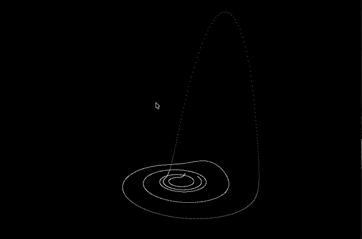

# Chaotic Attractors (C + SDL2)

This program numerically integrates and visualizes chaotic dynamical systems (Lorenz and Rössler) in real time using RK4 and SDL2. 
The parameters of visualization must be changed in order to obtain a clear image of the attractor.

  

  

  

  

  

  

